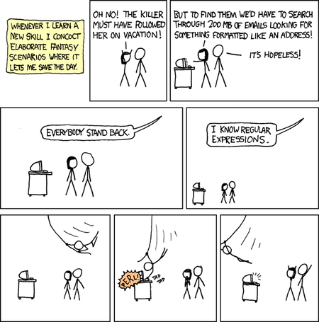

<style>
.forceBreak { -webkit-column-break-after: always; break-after: column; }
</style>

```{r setup, include=FALSE}
knitr::opts_chunk$set(echo = FALSE)
knitr::opts_chunk$set(tidy.opts=list(width.cutoff=60),tidy=TRUE)
```

## Regular Expressions {.columns-2 .smaller}


<p class="forceBreak"></p>

- A 'language' to represent text patterns - concept invented in the 1950's
- Bound by a set of rules (syntax); a set of special characters used to denote patterns
- Multi-platform: available (natively or through libraries) in many languages and tools (R, Python, Java, sed, awk)
- Use cases: 

    + read files with a specific naming pattern, e.g. 20190114_Mon_P1_W08_R2.csv, 20190114_Thurs_P10_W01_R3.csv
    + search for text patterns
    + replace text patterns

## The basics

+ Character classes `[]`

    + any character: `.`
    + alphabet: `[A-Z]` or `[:upper:]`, `[a-z]` or `[:lower:]`, `[A-Za-z]` or `[:alpha:]`
    + numeric: `[0-9]` or `[:digit:]` or `\d`
    + alphanumeric: `[A-Za-z0-9]` or `[:alnum:]`
    + whitespace (space, tab, linebreak): `\s`

+ quantifiers:

    + one or more (of the preceding character): `+`
    + zero or more: `*`
    + zero or one: `?`
    + specified number: `{m,}`, `{m,n}`
    
## The basics

+ anchors:
  
    + start: `^` (except in the context of `[^ ]`, where it is negation)
    + end: `$`
    
+ capture groups:
    
    + extract groups: `()`
    + refer to captured groups: `\1`, `\2`, etc.
+ metacharacters: `. \ | ( ) [ { ^ $ * + ? ,` 

## Examples

+ https://regexr.com/
+ in the string "the cat in the hat has a bat":

    + `[ch]at` matches `cat` and `hat`
    + `.at` matches `cat`, `hat` and `bat`
    + `[:alpha:]{1,2}` matches `in` and `a`
    + `.\s.` matches `e c`, `t i`, `n t`, `e h`, `t h`, `s a`, `a b`
    
## Strings in R

- Strings ("character" class) are represented in R using " or '
- But what about special characters like newlines and tabs? They are represented as escape sequences.`print` prints the escape sequence, whereas `cat` processes them.
```{r strings, echo = TRUE}
string = "First\tline\nSecond\tline"
print(string)
```
```{r, echo = TRUE}
cat(string)
```

## Strings in R
- What if the string contains an invalid escape character?
```{r, echo = TRUE, error=TRUE, results='asis'}
regex_string = ".\s."
```
- Regular expressions are represented as strings in R. But strings are processed first for escape characters. Unrecognised escape characters in strings throw an error, before even reaching the regex parser. 
- *Double backslashes* needed for regex escape sequences 
```{r, echo = TRUE, error=TRUE, results='asis'}
regex_string = ".\\s."
string = "the cat in the hat has a bat"
regexpr(regex_string, string)
```

## Quadruple backslashes!

- How do you match a literal backslash then?
```{r, echo = TRUE}
string = "Windows paths use \\ instead of /"
cat(string)
regex_string = "\\\\"
#str_detect(string, regex_string)
regexpr(regex_string, string)
```

## Base R functions that use regex

+ `grep()`
+ `grepl()`
+ `regexpr()`
+ `gregexpr()`
+ `sub()`
+ `gsub()`

+ `strsplit()`
+ `list.files()`

## Stringr functions

As with other Tidyverse functions, Stringr functions take the *text* as the first argument and the pattern as the second argument

+ `str_locate()` - like `regexpr()`, but returns an integer matrix
+ `str_detect()` - like `grepl()`
+ `str_split()` - like `strsplit()`
+ `str_extract()` - like `match = regexpr(pattern, string); substring(string, match, match + attr(match, "match.length") - 1)`

## Practical example

https://www.theatlantic.com/notes/2015/08/why-do-so-many-girlss-names-end-in-a/402823/

https://qz.com/1278574/a-large-share-of-us-baby-names-end-with-n-for-some-reason/


+ Using the babynames package (US Baby Names 1880-2017), let's look at trends in naming babies in the USA

## Names ending in 'a'

```{r, echo = FALSE, message=FALSE}
library(babynames)
library(stringr)
library(dplyr)
library(ggplot2)
library(ggpubr)
babynames %>%
  group_by(name, sex) %>%
  summarise(n = sum(n)) -> sum_babynames

sum_babynames %>%
  filter(str_detect(name, "a$")) %>% # this is for illustration purposes; endsWith() may be faster
  group_by(sex) %>%
  count() %>%
  ggplot(aes(x = sex, y = nn, fill = sex)) + 
    geom_col(colour = "black") +
    labs(title = "Names ending with 'a'") +
    theme_pubr(border = TRUE)
```

## Names ending in 'a': trends

```{r, echo = FALSE}
babynames %>%
  filter(str_detect(name, "a$")) %>% # this is for illustration purposes; endsWith() may be faster
  group_by(sex, year) %>% 
  summarise(prop_sum = sum(prop)) %>%
  ggplot(aes(x = year, y = prop_sum, colour = sex)) + 
    geom_line() +
    labs(title = "Names ending with 'a'") +
    theme_pubr(border = TRUE)
```

## Names ending in 'n': trends

```{r, echo = FALSE}
babynames %>%
  filter(str_detect(name, "n$")) %>% # this is for illustration purposes; endsWith() may be faster
  group_by(sex, year) %>% 
  summarise(prop_sum = sum(prop)) %>%
  ggplot(aes(x = year, y = prop_sum, colour = sex)) + 
    geom_line() +
    labs(title = "Names ending with 'n'") +
    theme_pubr(border = TRUE)
```

## Names ending in a vowel **other than 'a'**: trends
```{r, echo = FALSE}
babynames %>%
  filter(str_detect(name, "[eiou]$")) %>%
  group_by(sex, year) %>% 
  summarise(prop_sum = sum(prop)) %>%
  ggplot(aes(x = year, y = prop_sum, colour = sex)) + 
    geom_line() +
    labs(title = "Names ending with a vowel other than 'a'") +
    theme_pubr(border = TRUE)
```

## Names ending in a repeating pattern
```{r, echo = FALSE}
babynames %>%
  filter(str_detect(name, "[aeiou]([a-z])\\1[aeiou]$")) %>%
  group_by(sex, year) %>% 
  summarise(prop_sum = sum(prop)) %>%
  ggplot(aes(x = year, y = prop_sum, colour = sex)) + 
    geom_line() +
    labs(title = "Names like Stella or Bernadette") +
    theme_pubr(border = TRUE)
```

## Top repeating patterns

```{r, echo = FALSE}
babynames %>%
  mutate(extracted_part = str_extract(name, "[aeiou]([a-z])\\1[aeiou]$")) %>%
  filter(!is.na(extracted_part)) %>% 
  group_by(sex, year, extracted_part) %>% 
  summarise(prop_sum = sum(prop)) %>% 
  filter(prop_sum > 0.01) %>% 
  ggplot(aes(x = year, y = prop_sum, colour = extracted_part)) + 
    geom_line() +
    labs(title = "Names like Stella or Bernadette") +
    theme_pubr(border = TRUE)
```

## Names with other repeating patterns

```{r, echo = FALSE}
babynames %>%
  filter(str_detect(name, "(.{2})\\1")) %>%
  group_by(name, sex) %>% 
  summarise(total = sum(n)) %>%
  arrange(desc(total)) %>%
  head()
```

## Names without any vowels
```{r, echo = FALSE}

babynames %>%
  filter(str_detect(name, "^[^AEIOUaeiou]+$")) %>%
  group_by(sex, year) %>% 
  summarise(prop_sum = sum(prop)) %>%
  ggplot(aes(x = year, y = prop_sum, colour = sex)) + 
    geom_line() +
    labs(title = "Names without any vowels") +
    theme_pubr(border = TRUE)
```

## Abcde

https://www.straitstimes.com/world/united-states/us-airline-apologises-after-employee-mocks-child-named-abcde

```{r, echo = FALSE}
babynames %>%
  filter(str_detect(name, "[Aa]bcde")) %>%
  group_by(sex, year) %>% 
  #count() %>% head()
  ggplot(aes(x = year, y = n, colour = sex)) + 
    geom_line() +
    labs(title = "People named 'Abcde") +
    theme_pubr(border = TRUE)
```

## ozbabynames

```{r, echo = FALSE, message=FALSE}
library(ozbabynames)
ozbabynames %>% 
  group_by(sex, year) %>% 
  summarise(total_in_year = sum(count)) %>% 
  right_join(ozbabynames) %>% 
  mutate(prop = count/total_in_year) -> ozbabynames_prop

ozbabynames_prop %>%
  filter(str_detect(name, "^[^AEIOUaeiou]+$")) %>%
  group_by(sex, year) %>% 
  summarise(prop_sum = sum(prop)) %>%
  ggplot(aes(x = year, y = prop_sum, colour = sex)) + 
    geom_line() +
    labs(title = "Names without any vowels (Australia)") +
    theme_pubr(border = TRUE)
```

## Two problems?
**Some people, when confronted with a problem, think "I know, I'll use regular expressions." Now they have two problems. - Jamie Zawinski**


https://blog.codinghorror.com/regex-use-vs-regex-abuse/

## Commenting within a regex

+ natively with `(?#...)`
+ `stringr::regex(comments = TRUE)` allows for more legible formatting and commenting of regular expressions

    + ignores spaces and newlines (literal space must be escaped with \\)
    + ignores everything after #

```{r, echo = TRUE}
rep_letter_pattern <- stringr::regex("[aeiou] # a lower case vowel
                                     ([a-z])  # any lower case letter, captured as the 1st group
                                     \\1      # the above group is repeated
                                     [aeiou]  # a lower case vowel
                                     $        # the above 4 characters must be at the end of the string
                                     ", comments = TRUE)
str_extract("Arabella", rep_letter_pattern)
```